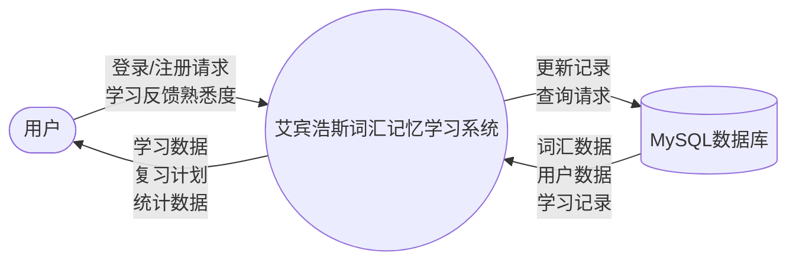

# 1.1 顶层数据流图（第0层）

```mermaid
graph LR
    U([用户])
    S((艾宾浩斯词汇记忆学习系统))
    DB[(MySQL数据库)]

    U -- 登录/注册请求<br/>学习反馈熟悉度 --> S
    S -- 学习数据<br/>复习计划<br/>统计数据 --> U
    DB -- 词汇数据<br/>用户数据<br/>学习记录 --> S
    S -- 更新记录<br/>查询请求 --> DB
```
