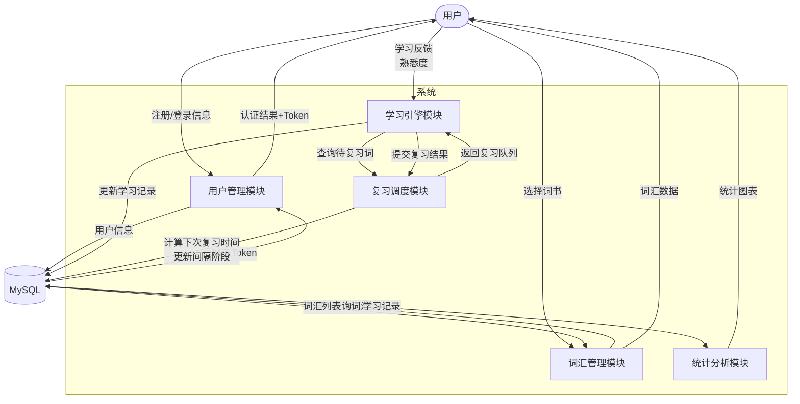

# 1.2 第1层数据流图

```mermaid
graph TD
    U([用户])

    subgraph 系统
        A[用户管理模块]
        B[词汇管理模块]
        C[学习引擎模块]
        D[复习调度模块]
        E[统计分析模块]
    end

    DB[(MySQL)]

    U -->|注册/登录信息| A
    A -->|用户信息| DB
    DB -->|JWT Token| A
    A -->|认证结果+Token| U

    U -->|选择词书| B
    B -->|查询词汇| DB
    DB -->|词汇列表| B
    B -->|词汇数据| U

    U -->|学习反馈<br/>熟悉度| C
    C -->|查询待复习词| D
    D -->|返回复习队列| C
    C -->|更新学习记录| DB
    DB -->|学习记录| E
    E -->|统计图表| U

    C -->|提交复习结果| D
    D -->|计算下次复习时间<br/>更新间隔阶段| DB
```
