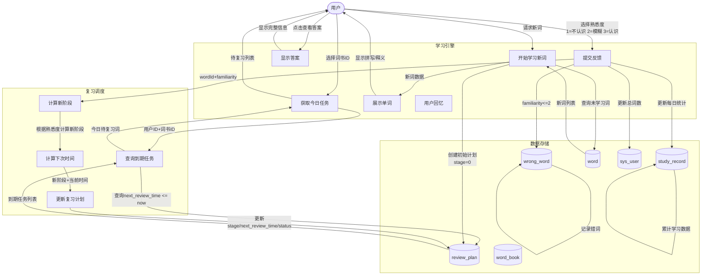

# 1.3 第2层数据流图 — 学习引擎模块细化

```mermaid
graph TD
    U([用户])

    subgraph 学习引擎
        C1[获取今日任务]
        C2[开始学习新词]
        C3[展示单词]
        C4[用户回忆]
        C5[显示答案]
        C6[提交反馈]
    end

    subgraph 复习调度
        D1[查询到期任务]
        D2[计算新阶段]
        D3[计算下次时间]
        D4[更新复习计划]
    end

    subgraph 数据存储
        RP[(review_plan)]
        WR[(wrong_word)]
        SR[(study_record)]
        WB[(word_book)]
        WD[(word)]
        US[(sys_user)]
    end

    U -->|选择词书ID| C1
    C1 -->|用户ID+词书ID| D1
    D1 -->|查询next_review_time <= now| RP
    RP -->|到期任务列表| D1
    D1 -->|今日待复习词| C1
    C1 -->|待复习列表| U

    U -->|请求新词| C2
    C2 -->|查询未学习词| WD
    WD -->|新词列表| C2
    C2 -->|创建初始计划<br/>stage=0| RP
    C2 -->|新词数据| C3

    C3 -->|显示拼写/释义| U
    U -->|点击查看答案| C5
    C5 -->|显示完整信息| U
    U -->|选择熟悉度<br/>1=不认识 2=模糊 3=认识| C6

    C6 -->|wordId+familiarity| D2
    D2 -->|根据熟悉度计算新阶段| D3
    D3 -->|新阶段+当前时间| D4
    D4 -->|更新stage/next_review_time/status| RP

    C6 -->|familiarity<=2| WR
    WR -->|记录错词| WR

    C6 -->|更新每日统计| SR
    SR -->|累计学习数据| SR

    C6 -->|更新总词数| US
```
