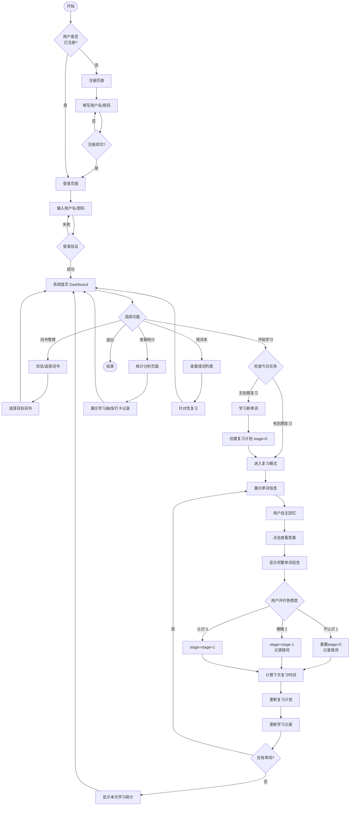

# 2.1 总体系统流程图

```mermaid
graph TD
    START([开始]) --> A{"用户是否<br/>已注册?"}
    A -- 否 --> B[注册页面]
    B --> C[填写用户名/密码]
    C --> D{注册成功?}
    D -- 否 --> C
    D -- 是 --> E[登录页面]
    A -- 是 --> E

    E --> F[输入用户名/密码]
    F --> G{登录验证}
    G -- 失败 --> F
    G -- 成功 --> H[系统首页 Dashboard]

    H --> I{选择功能}
    I -- 词书管理 --> J[浏览/选择词书]
    J --> K[选择目标词书]
    K --> H

    I -- 开始学习 --> L{检查今日任务}
    L -- 有到期复习 --> M[进入复习模式]
    L -- 无到期复习 --> N[学习新单词]
    N --> O[创建复习计划 stage=0]
    O --> M

    M --> P[展示单词信息]
    P --> Q[用户自主回忆]
    Q --> R[点击查看答案]
    R --> S[显示完整单词信息]
    S --> T{用户评价熟悉度}

    T -->|不认识 1| U["重置stage=0<br/>记录错词"]
    T -->|模糊 2| V["stage=stage-1<br/>记录错词"]
    T -->|认识 3| W[stage=stage+1]

    U --> X[计算下次复习时间]
    V --> X
    W --> X

    X --> Y[更新复习计划]
    Y --> Z[更新学习记录]
    Z --> AA{还有单词?}
    AA -- 是 --> P
    AA -- 否 --> AB[显示本次学习统计]
    AB --> H

    I -- 查看统计 --> AC[统计分析页面]
    AC --> AD[展示学习曲线/打卡记录]
    AD --> H

    I -- 错词本 --> AE[查看错词列表]
    AE --> AF[针对性复习]
    AF --> H

    I -- 退出 --> AG([结束])
```
