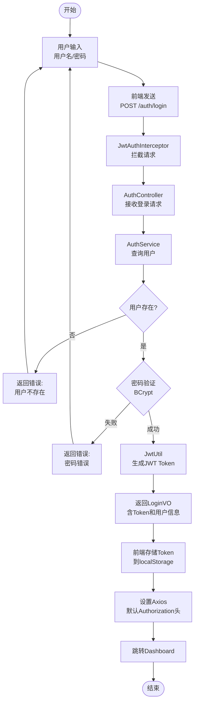

# 2.2 用户认证流程图

```mermaid
graph TD
    START([开始]) --> A["用户输入<br/>用户名/密码"]
    A --> B["前端发送<br/>POST /auth/login"]
    B --> C["JwtAuthInterceptor<br/>拦截请求"]
    C --> D["AuthController<br/>接收登录请求"]
    D --> E["AuthService<br/>查询用户"]
    E --> F{用户存在?}
    F -- 否 --> G["返回错误:<br/>用户不存在"]
    G --> A
    F -- 是 --> H{"密码验证<br/>BCrypt"}
    H -- 失败 --> I["返回错误:<br/>密码错误"]
    I --> A
    H -- 成功 --> J["JwtUtil<br/>生成JWT Token"]
    J --> K["返回LoginVO<br/>含Token和用户信息"]
    K --> L["前端存储Token<br/>到localStorage"]
    L --> M["设置Axios<br/>默认Authorization头"]
    M --> N[跳转Dashboard]
    N --> END([结束])
```
