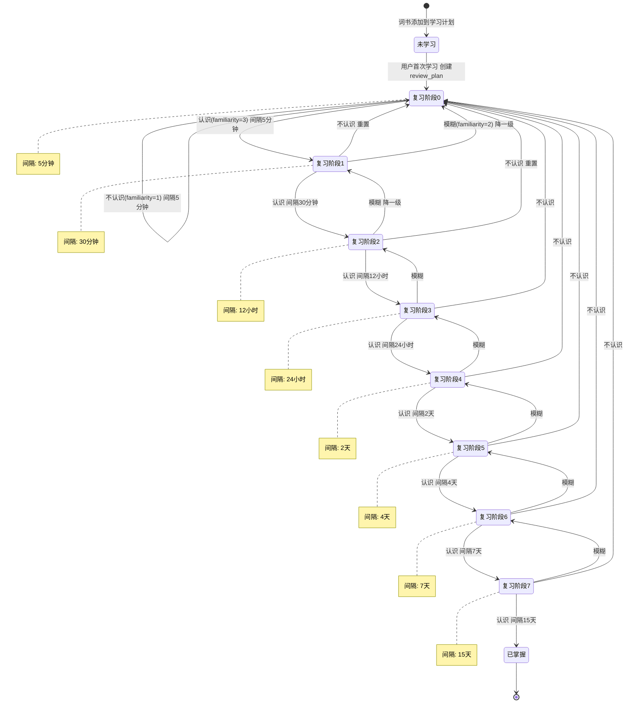

# 3.1 单词复习状态转换图

```mermaid
stateDiagram-v2
    [*] --> 未学习 : 词书添加到学习计划

    未学习 --> 复习阶段0 : 用户首次学习 创建review_plan

    复习阶段0 --> 复习阶段1 : 认识(familiarity=3) 间隔5分钟
    复习阶段0 --> 复习阶段0 : 不认识(familiarity=1) 间隔5分钟

    复习阶段1 --> 复习阶段2 : 认识 间隔30分钟
    复习阶段1 --> 复习阶段0 : 不认识 重置
    复习阶段1 --> 复习阶段0 : 模糊(familiarity=2) 降一级

    复习阶段2 --> 复习阶段3 : 认识 间隔12小时
    复习阶段2 --> 复习阶段1 : 模糊 降一级
    复习阶段2 --> 复习阶段0 : 不认识 重置

    复习阶段3 --> 复习阶段4 : 认识 间隔24小时
    复习阶段3 --> 复习阶段2 : 模糊
    复习阶段3 --> 复习阶段0 : 不认识

    复习阶段4 --> 复习阶段5 : 认识 间隔2天
    复习阶段4 --> 复习阶段3 : 模糊
    复习阶段4 --> 复习阶段0 : 不认识

    复习阶段5 --> 复习阶段6 : 认识 间隔4天
    复习阶段5 --> 复习阶段4 : 模糊
    复习阶段5 --> 复习阶段0 : 不认识

    复习阶段6 --> 复习阶段7 : 认识 间隔7天
    复习阶段6 --> 复习阶段5 : 模糊
    复习阶段6 --> 复习阶段0 : 不认识

    复习阶段7 --> 已掌握 : 认识 间隔15天
    复习阶段7 --> 复习阶段6 : 模糊
    复习阶段7 --> 复习阶段0 : 不认识

    已掌握 --> [*]

    note right of 复习阶段0
        间隔: 5分钟
    end note
    note right of 复习阶段1
        间隔: 30分钟
    end note
    note right of 复习阶段2
        间隔: 12小时
    end note
    note right of 复习阶段3
        间隔: 24小时
    end note
    note right of 复习阶段4
        间隔: 2天
    end note
    note right of 复习阶段5
        间隔: 4天
    end note
    note right of 复习阶段6
        间隔: 7天
    end note
    note right of 复习阶段7
        间隔: 15天
    end note
```
