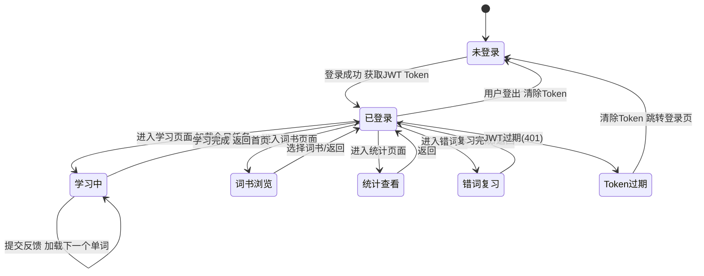

# 3.2 用户会话状态转换图

```mermaid
stateDiagram-v2
    [*] --> 未登录

    未登录 --> 已登录 : 登录成功 获取JWT Token

    已登录 --> 学习中 : 进入学习页面 加载今日任务
    已登录 --> 词书浏览 : 进入词书页面
    已登录 --> 统计查看 : 进入统计页面
    已登录 --> 错词复习 : 进入错词本

    学习中 --> 学习中 : 提交反馈 加载下一个单词
    学习中 --> 已登录 : 学习完成 返回首页

    词书浏览 --> 已登录 : 选择词书/返回
    统计查看 --> 已登录 : 返回
    错词复习 --> 已登录 : 复习完成/返回

    已登录 --> Token过期 : JWT过期(401)
    Token过期 --> 未登录 : 清除Token 跳转登录页

    已登录 --> 未登录 : 用户登出 清除Token
```
