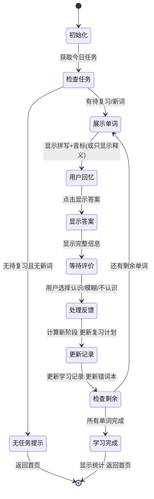

# 3.3 学习会话状态转换图

```mermaid
stateDiagram-v2
    [*] --> 初始化

    初始化 --> 检查任务 : 获取今日任务

    检查任务 --> 展示单词 : 有待复习/新词
    检查任务 --> 无任务提示 : 无待复习且无新词

    展示单词 --> 用户回忆 : 显示拼写+音标(或只显示释义)
    用户回忆 --> 显示答案 : 点击显示答案
    显示答案 --> 等待评价 : 显示完整信息

    等待评价 --> 处理反馈 : 用户选择认识/模糊/不认识
    处理反馈 --> 更新记录 : 计算新阶段 更新复习计划
    更新记录 --> 检查剩余 : 更新学习记录 更新错词本

    检查剩余 --> 展示单词 : 还有剩余单词
    检查剩余 --> 学习完成 : 所有单词完成

    无任务提示 --> [*] : 返回首页
    学习完成 --> [*] : 显示统计 返回首页
```
