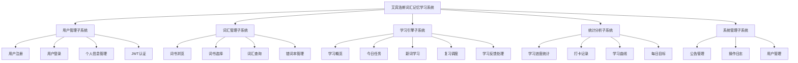

# 4.1 总体系统结构图

```mermaid
graph TD
    A[艾宾浩斯词汇记忆学习系统]

    A --> B[用户管理子系统]
    A --> C[词汇管理子系统]
    A --> D[学习引擎子系统]
    A --> E[统计分析子系统]
    A --> F[系统管理子系统]

    B --> B1[用户注册]
    B --> B2[用户登录]
    B --> B3[个人信息管理]
    B --> B4[JWT认证]

    C --> C1[词书浏览]
    C --> C2[词书选择]
    C --> C3[词汇查询]
    C --> C4[错词本管理]

    D --> D1[学习概览]
    D --> D2[今日任务]
    D --> D3[新词学习]
    D --> D4[复习调度]
    D --> D5[学习反馈处理]

    E --> E1[学习进度统计]
    E --> E2[打卡记录]
    E --> E3[学习曲线]
    E --> E4[每日目标]

    F --> F1[公告管理]
    F --> F2[操作日志]
    F --> F3[用户管理]
```
