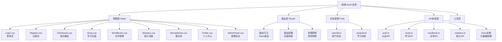

# 4.2 前端系统结构图

```mermaid
graph TD
    FE[前端 Vue3 应用]

    FE --> V[视图层 Views]
    FE --> R[路由层 Router]
    FE --> S[状态管理 Pinia]
    FE --> API[API封装层]
    FE --> UT[工具层]

    V --> V1["Login.vue<br/>登录页"]
    V --> V2["Register.vue<br/>注册页"]
    V --> V3["Dashboard.vue<br/>首页概览"]
    V --> V4["Study.vue<br/>学习页面"]
    V --> V5["WordBooks.vue<br/>词书管理"]
    V --> V6["Statistics.vue<br/>统计页面"]
    V --> V7["WrongWords.vue<br/>错词本"]
    V --> V8["Profile.vue<br/>个人中心"]
    V --> V9["AdminPanel.vue<br/>管理后台"]

    R --> R1["路由守卫<br/>Token验证"]
    R --> R2["路由配置<br/>页面映射"]
    R --> R3["权限控制<br/>角色判断"]

    S --> S1["userStore<br/>用户状态"]
    S --> S2["studyStore<br/>学习状态"]

    API --> API1["auth.ts<br/>认证API"]
    API --> API2["study.ts<br/>学习API"]
    API --> API3["wordbook.ts<br/>词书API"]
    API --> API4["statistics.ts<br/>统计API"]
    API --> API5["Axios实例<br/>拦截器配置"]
```
