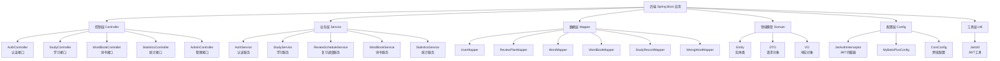

# 4.3 后端系统结构图

```mermaid
graph TD
    BE[后端 Spring Boot 应用]

    BE --> CTRL[控制层 Controller]
    BE --> SVC[业务层 Service]
    BE --> MAPPER[数据层 Mapper]
    BE --> DOMAIN[领域模型 Domain]
    BE --> CFG[配置层 Config]
    BE --> UTIL[工具层 Util]

    CTRL --> CTRL1["AuthController<br/>认证接口"]
    CTRL --> CTRL2["StudyController<br/>学习接口"]
    CTRL --> CTRL3["WordBookController<br/>词书接口"]
    CTRL --> CTRL4["StatisticsController<br/>统计接口"]
    CTRL --> CTRL5["AdminController<br/>管理接口"]

    SVC --> SVC1["AuthService<br/>认证服务"]
    SVC --> SVC2["StudyService<br/>学习服务"]
    SVC --> SVC3["ReviewScheduleService<br/>复习调度服务"]
    SVC --> SVC4["WordBookService<br/>词书服务"]
    SVC --> SVC5["StatisticsService<br/>统计服务"]

    MAPPER --> MAPPER1[UserMapper]
    MAPPER --> MAPPER2[ReviewPlanMapper]
    MAPPER --> MAPPER3[WordMapper]
    MAPPER --> MAPPER4[WordBookMapper]
    MAPPER --> MAPPER5[StudyRecordMapper]
    MAPPER --> MAPPER6[WrongWordMapper]

    DOMAIN --> D1["Entity<br/>实体类"]
    DOMAIN --> D2["DTO<br/>请求对象"]
    DOMAIN --> D3["VO<br/>响应对象"]

    CFG --> CFG1["JwtAuthInterceptor<br/>JWT拦截器"]
    CFG --> CFG2[MyBatisPlusConfig]
    CFG --> CFG3["CorsConfig<br/>跨域配置"]

    UTIL --> UTIL1["JwtUtil<br/>JWT工具"]
```
