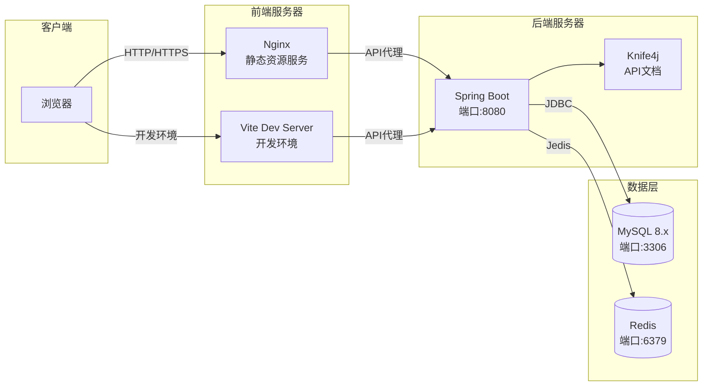

# 4.4 系统部署架构图

```mermaid
graph LR
    subgraph 客户端
        B[浏览器]
    end

    subgraph 前端服务器
        NG[Nginx<br/>静态资源服务]
        VD[Vite Dev Server<br/>开发环境]
    end

    subgraph 后端服务器
        SB[Spring Boot<br/>端口:8080]
        KJ[Knife4j<br/>API文档]
    end

    subgraph 数据层
        MY[(MySQL 8.x<br/>端口:3306)]
        RD[(Redis<br/>端口:6379)]
    end

    B -->|HTTP/HTTPS| NG
    B -->|开发环境| VD
    NG -->|API代理| SB
    VD -->|API代理| SB
    SB --> KJ
    SB -->|JDBC| MY
    SB -->|Jedis| RD
```
