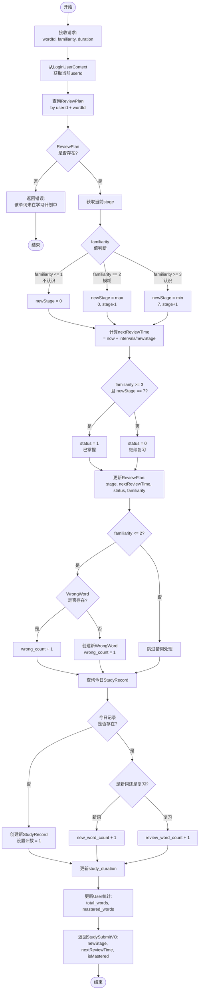

# 6.1 学习反馈处理算法 — 流程图

```mermaid
graph TD
    START([开始]) --> A["接收请求:<br/>wordId, familiarity, duration"]
    A --> B["从LoginUserContext<br/>获取当前userId"]
    B --> C["查询ReviewPlan<br/>by userId + wordId"]
    C --> D{"ReviewPlan<br/>是否存在?"}

    D -- 否 --> E["返回错误:<br/>该单词未在学习计划中"]
    E --> END1([结束])

    D -- 是 --> F[获取当前stage]
    F --> G{"familiarity<br/>值判断"}

    G -->|familiarity <= 1<br/>不认识| H[newStage = 0]
    G -->|familiarity == 2<br/>模糊| I["newStage = max<br/>0, stage-1"]
    G -->|familiarity >= 3<br/>认识| J["newStage = min<br/>7, stage+1"]

    H --> K["计算nextReviewTime<br/>= now + intervals/newStage"]
    I --> K
    J --> K

    K --> L{"familiarity >= 3<br/>且 newStage == 7?"}
    L -- 是 --> M["status = 1<br/>已掌握"]
    L -- 否 --> N["status = 0<br/>继续复习"]

    M --> O["更新ReviewPlan:<br/>stage, nextReviewTime, status, familiarity"]
    N --> O

    O --> P{familiarity <= 2?}
    P -- 是 --> Q{WrongWord<br/>是否存在?}
    Q -- 是 --> R[wrong_count + 1]
    Q -- 否 --> S["创建新WrongWord<br/>wrong_count = 1"]
    P -- 否 --> T[跳过错词处理]

    R --> U[查询今日StudyRecord]
    S --> U
    T --> U

    U --> V{"今日记录<br/>是否存在?"}
    V -- 否 --> W["创建新StudyRecord<br/>设置计数 = 1"]
    V -- 是 --> X{是新词还是复习?}
    X -- 新词 --> Y[new_word_count + 1]
    X -- 复习 --> Z[review_word_count + 1]

    W --> AA[更新study_duration]
    Y --> AA
    Z --> AA

    AA --> AB["更新User统计:<br/>total_words, mastered_words"]
    AB --> AC["返回StudySubmitVO:<br/>newStage, nextReviewTime, isMastered"]
    AC --> END2([结束])
```
