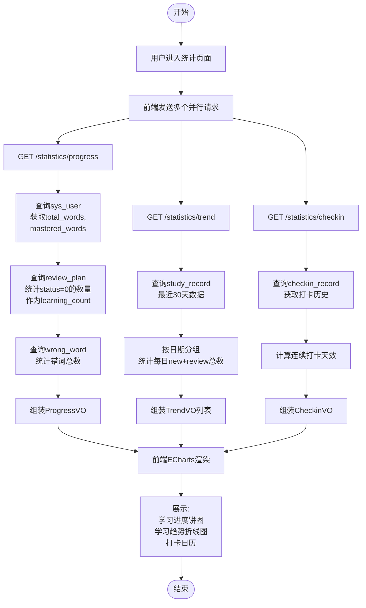

# 6.11 统计数据获取算法 — 流程图

```mermaid
graph TD
    START([开始]) --> A[用户进入统计页面]
    A --> B[前端发送多个并行请求]

    B --> C1[GET /statistics/progress]
    B --> C2[GET /statistics/trend]
    B --> C3[GET /statistics/checkin]

    C1 --> D1["查询sys_user<br/>获取total_words,<br/>mastered_words"]
    D1 --> E1["查询review_plan<br/>统计status=0的数量<br/>作为learning_count"]
    E1 --> F1["查询wrong_word<br/>统计错词总数"]
    F1 --> G1[组装ProgressVO]

    C2 --> D2["查询study_record<br/>最近30天数据"]
    D2 --> E2["按日期分组<br/>统计每日new+review总数"]
    E2 --> G2[组装TrendVO列表]

    C3 --> D3["查询checkin_record<br/>获取打卡历史"]
    D3 --> E3[计算连续打卡天数]
    E3 --> G3[组装CheckinVO]

    G1 --> H[前端ECharts渲染]
    G2 --> H
    G3 --> H

    H --> I["展示:<br/>学习进度饼图<br/>学习趋势折线图<br/>打卡日历"]
    I --> END([结束])
```
