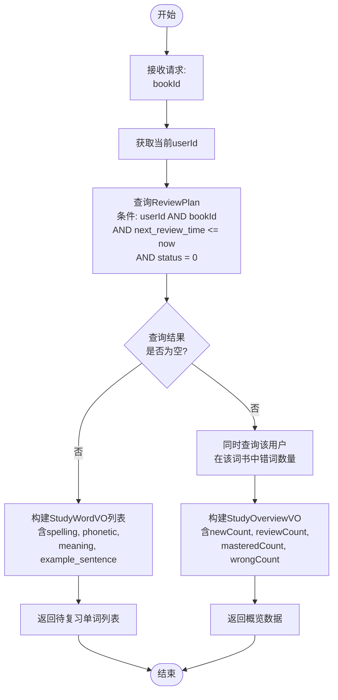

# 6.5 获取今日任务算法 — 流程图

```mermaid
graph TD
    START([开始]) --> A["接收请求:<br/>bookId"]
    A --> B[获取当前userId]
    B --> C["查询ReviewPlan<br/>条件: userId AND bookId<br/>AND next_review_time <= now<br/>AND status = 0"]
    C --> D{"查询结果<br/>是否为空?"}

    D -- 否 --> E["构建StudyWordVO列表<br/>含spelling, phonetic,<br/>meaning, example_sentence"]
    E --> F[返回待复习单词列表]

    D -- 否 --> G["同时查询该用户<br/>在该词书中错词数量"]
    G --> H["构建StudyOverviewVO<br/>含newCount, reviewCount,<br/>masteredCount, wrongCount"]
    H --> I[返回概览数据]

    F --> END([结束])
    I --> END
```
