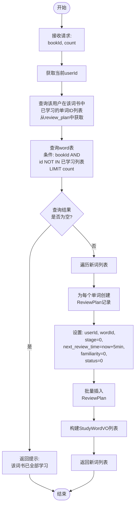

# 6.6 开始学习新词算法 — 流程图

```mermaid
graph TD
    START([开始]) --> A["接收请求:<br/>bookId, count"]
    A --> B[获取当前userId]
    B --> C["查询该用户在该词书中<br/>已学习的单词ID列表<br/>从review_plan中获取"]
    C --> D["查询word表<br/>条件: bookId AND<br/>id NOT IN 已学习列表<br/>LIMIT count"]
    D --> E{"查询结果<br/>是否为空?"}

    E -- 是 --> F["返回提示:<br/>该词书已全部学习"]
    F --> END([结束])

    E -- 否 --> G[遍历新词列表]
    G --> H["为每个单词创建<br/>ReviewPlan记录"]
    H --> I["设置: userId, wordId,<br/>stage=0,<br/>next_review_time=now+5min,<br/>familiarity=0,<br/>status=0"]
    I --> J["批量插入<br/>ReviewPlan"]
    J --> K[构建StudyWordVO列表]
    K --> L[返回新词列表]
    L --> END
```
