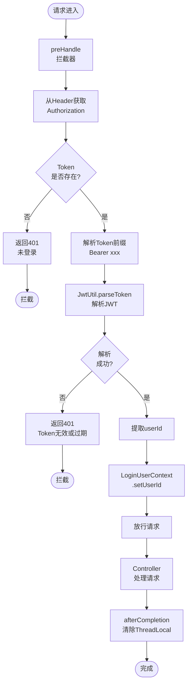

# 6.8 JWT认证拦截算法 — 流程图

```mermaid
graph TD
    START([请求进入]) --> A["preHandle<br/>拦截器"]
    A --> B["从Header获取<br/>Authorization"]
    B --> C{"Token<br/>是否存在?"}

    C -- 否 --> D["返回401<br/>未登录"]
    D --> END1([拦截])

    C -- 是 --> E["解析Token前缀<br/>Bearer xxx"]
    E --> F["JwtUtil.parseToken<br/>解析JWT"]
    F --> G{"解析<br/>成功?"}

    G -- 否 --> H["返回401<br/>Token无效或过期"]
    H --> END2([拦截])

    G -- 是 --> I[提取userId]
    I --> J["LoginUserContext<br/>.setUserId"]
    J --> K[放行请求]
    K --> L["Controller<br/>处理请求"]
    L --> M["afterCompletion<br/>清除ThreadLocal"]
    M --> END3([完成])
```
